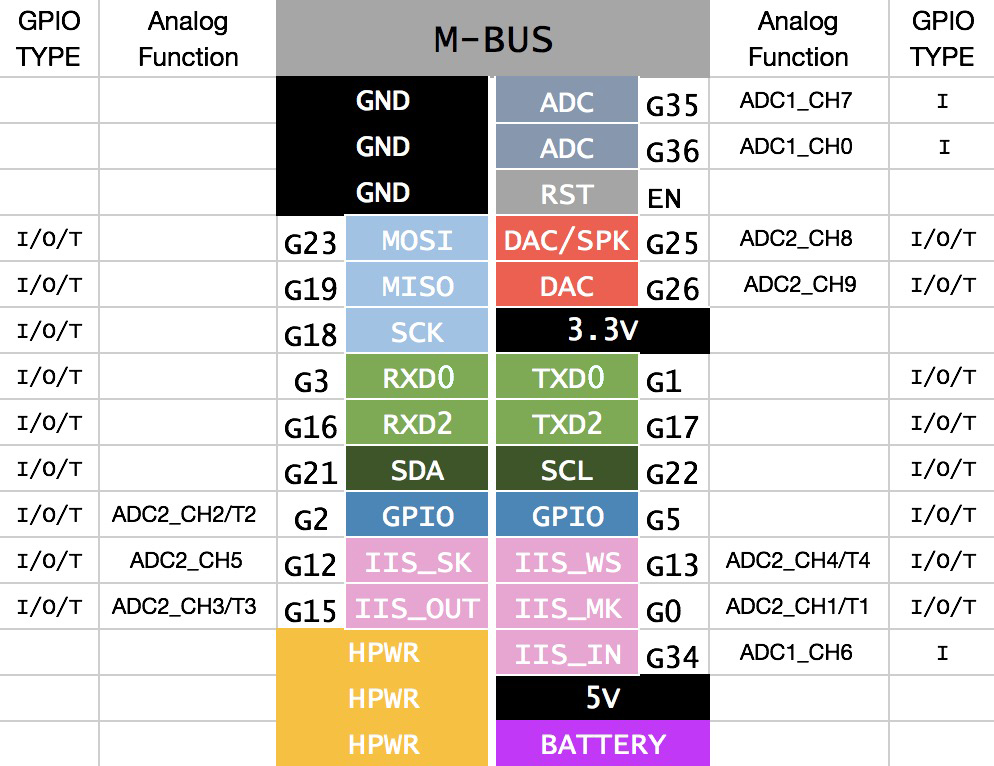

# M5Stack Library

English | [中文](docs/getting_started_cn.md) | [日本語](docs/getting_started_ja.md)

* **For the Detailed documentation of Gray, please [Click here](https://docs.m5stack.com/en/core/gray)**

* **For the Detailed documentation of Basic, please [Click here](https://docs.m5stack.com/en/core/basic_v2.6)**

* **In order to buy Gray, please [Click here](https://shop.m5stack.com/products/grey-development-core)**

* **In order to buy Basic, please [Click here](https://shop.m5stack.com/products/esp32-basic-core-iot-development-kit-v2-6)**

*We have several master M5Cores with different configurations, this is the difference between them [Compared](https://docs.m5stack.com/en/products_selector).*

### M-BUS

## More Information

**UIFlow Quick Start**: [Click Here](https://docs.m5stack.com/zh_CN/quick_start/m5core/uiflow)

**MicroPython API**: [Click Here](https://docs.m5stack.com/zh_CN/mpy/display/m5stack_lvgl)

**Arduino IDE Development**: [Click Here](https://docs.m5stack.com/zh_CN/quick_start/m5core/arduino)

**M5StickC Arduino API**: [Click Here](https://docs.m5stack.com/zh_CN/api/system)

**Gray PinMap**: [Click Here](https://docs.m5stack.com/zh_CN/core/gray)

**Basic PinMap**: [Click Here](https://docs.m5stack.com/zh_CN/core/basic)

## USER CASES

* [M5Stack-SD-Updater](https://github.com/tobozo/M5Stack-SD-Updater) - Customizable menu system for M5Stack - loads apps from the Micro SD
  card

* [TFT_eSPI](https://github.com/Bodmer/TFT_eSPI)  - TFT library for the ESP8266 and ESP32 that supports different driver chips

* [M5StackSAM](https://github.com/tomsuch/M5StackSAM) - Simple Applications Menu Arduino Library for M5Stack

* [cfGUI](https://github.com/JF002/cfGUI) - A simple GUI library for M5Stack (ESP32)

* [GUIslice](https://github.com/ImpulseAdventure/GUIslice) - A lightweight GUI framework suitable for embedded displays

* [M5ez](https://github.com/M5ez/M5ez) - The easy way to program on the M5Stack

* [M5Stack MultiApp Advanced](https://github.com/botofancalin/M5Stack-MultiApp-Advanced) - A M5Stack firmware made on PlatformIO

* [M5Stack ESP32 Oscilloscope](https://github.com/botofancalin/M5Stack-ESP32-Oscilloscope) - A fully functional oscilloscope based on ESP32 M5Stack

* [M5Stack-Avatar](https://github.com/meganetaaan/m5stack-avatar) - An M5Stack library for rendering avatar faces

* [M5Stack_CrackScreen](https://github.com/nomolk/M5Stack_CrackScreen) - Crack your M5Stack!!

* [M5_Shuttle_Run](https://github.com/n0bisuke/M5_Shuttle_Run) - M5_Shuttle_Run

* [nixietubeM5](https://github.com/drayde/nixietubeM5) - (Fake) Nixie Tube Display on a M5Stack

* [M5Stack_BTCTicker](https://github.com/dankelley2/M5Stack_BTCTicker) - A small Bitcoin price ticker using an M5Stack (ESP32) and the Coindesk API

* [M5Stack_ETHPrice](https://github.com/donma/M5StackWifiSettingWithETHPrice) - Dependence on example Wifi Setting to get ETH Price from Maicoin

* [M5Stack-PacketMonitor](https://github.com/tobozo/M5Stack-PacketMonitor) - M5Stack ESP32 Packet Monitor

* [M5-FFT](https://github.com/ElectroMagus/M5-FFT) - Graphic Equalizer on the M5Stack platform

* [M5Stack_ESP32_radio](https://github.com/anton-b/M5Stack_ESP32_radio) - Playing mp3 stream out of internet using M5Stack prototype

* [mp3-player-m5stack](https://github.com/dsiberia9s/mp3-player-m5stack) - MP3 player for M5Stack

* [ArduinoWiFiPhotoBackup](https://github.com/moononournation/ArduinoWiFiPhotoBackup) - M5STACK Arduino WiFi Photo Backup device

* [M5StackHIDCtrlAltDel](https://github.com/mhama/M5StackHIDCtrlAltDel) - You can send ctrl+alt+del to your PC from M5Stack

* [M5Stack Markdown Web Server](https://github.com/PartsandCircuits/M5Stack-MarkdownWebServer) - Markdown & icons loaded from an Micro SD card/TF card to run a web page

* [M5Stack-Tetris](https://github.com/PartsandCircuits/M5Stack-Tetris) - Tetris for M5Stack Ported to M5Stack by macsbug - https://macsbug.wordpress.com/

* [M5Stack_FlappyBird_game](https://github.com/pcelli85/M5Stack_FlappyBird_game) - M5Stack FlappyBird Playable

* [M5Stack-SpaceShooter](https://github.com/PartsandCircuits/M5Stack-SpaceShooter) - Space Invaders knock-off for M5Stack

* [M5Stack-Pacman-JoyPSP](https://github.com/tobozo/M5Stack-Pacman-JoyPSP) - Pacman on M5Stack/PSP Joypad, with sounds

* [M5Stack-Thermal-Camera](https://github.com/hkoffer/M5Stack-Thermal-Camera-) - M5Stack Thermal Camera with AMG8833 thermal sensor

* [truetype2gfx](https://github.com/ropg/truetype2gfx) - Converting fonts from TrueType to Adafruit GFX

* [m5stack-onscreen-keyboard](https://github.com/yellowelise/m5stack-onscreen-keyboard) - Full size qwerty keyboard for M5Stack
