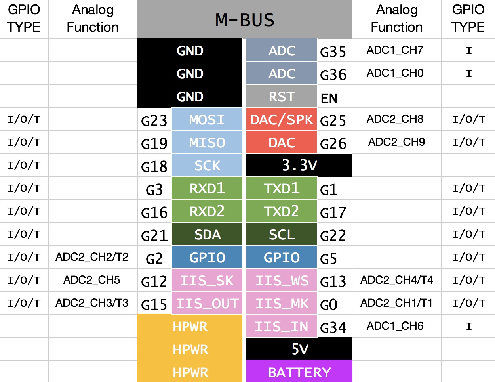

# M5Stack Library

## Usage
### Installing the USB Driver
- [Download the SiLabs CP2104 Driver](https://www.silabs.com/community/interface/knowledge-base.entry.html/2017/01/10/legacy_os_softwarea-bgvU)

### Using with Arduino IDE
Espressif’s official ESP32 Arduino core is hosted here on GitHub:
- [Installing the ESP32 Arduino Core](https://github.com/espressif/arduino-esp32#installation-instructions)

### Download Library

#### Arduino

#### Using the Arduino IDE Library Manager

1. Choose ```Sketch``` -> ```Include Library``` -> ```Manage Libraries...```
2. Type ```m5stack``` into the search box.
3. Click the row to select the library.
4. Click the ```Install``` button to install the library.
5. Click "File-> Examples". Here are some test programs in "M5Stack->"

#### Using Git
```sh
cd ~/Documents/Arduino/libraries/
git clone https://github.com/m5stack/M5Stack.git
```

## API
See [API.md](https://github.com/m5stack/M5Stack/blob/master/src/M5Stack.h#L19).

## Examples
See [examples](examples) folder.


## Hardware
### Pinout
Peripheral Devices | ESP32 
---|---
ILI9341 RST | GPIO33 
ILI9341 DC | GPIO27 
ILI9341 CS | GPIO14
ILI9341 MOSI | GPIO23
ILI9341 CLK | GPIO18
ILI9341 LIGHT | GPIO32
TFCARD MOSI | GPIO23
TFCARD MISO | GPIO19
TFCARD CLK | GPIO18
TFCARD CS | GPIO4
BUTTON A | GPIO39
BUTTON B | GPIO38
BUTTON C | GPIO37
SPEAKER | GPIO25
MPU9250 SDA | GPIO21
MPU9250 SCL | GPIO22
GOVER SDA | GPIO21
GOVER SCL | GPIO22

### M-BUS
