# M5Stack Arduino — 快速上手


## 一、安装 USB 驱动

点击以下链接，下载 M5Stack-Core 的 USB 转串口驱动

https://www.silabs.com/products/development-tools/software/usb-to-uart-bridge-vcp-drivers

下载完之后，解压，根据系统位数，双击对应可执行文件

(Windows 32位，执行 CP210xVCPInstaller_x68.exe；Windows 64位，执行 CP210xVCPInstaller_x64.exe；)

*判断驱动安装是否成功：*
如果安装成功，在插入 M5Stack 主控之后，设备管理器如下图所示出现，Silicon Labs 的 CP21x 系列串口端口号
(我的电脑当前串口号是 COM3)

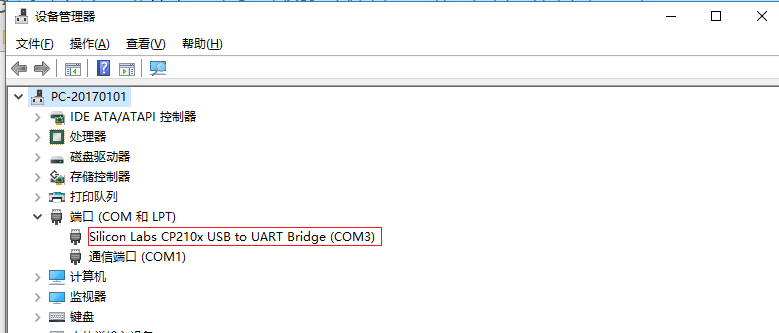


## 二、开发环境
## **Windows**
### 1、安装 Arduino IDE

*下载地址*
https://www.arduino.cc/en/Main/Software 

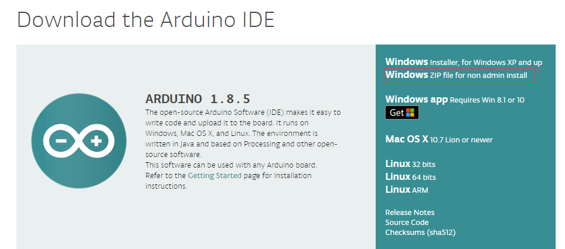


如下图所示修改 Arduino 路径为 D:\Program Files

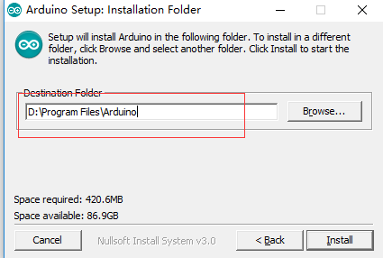


此时，Arduino 的安装路径为 D:\Program Files\Arduino

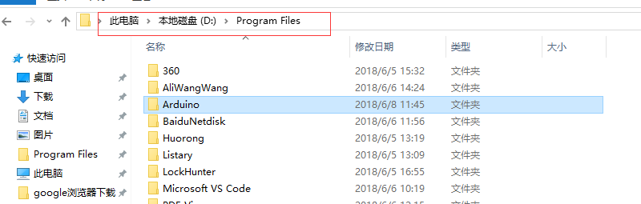


### 2、下载 ESP32 相关支持包

（我的 Arduino 当前路径是 D:\Program Files\arduino）

进入 Arduino 安装路径的 hareware 文件夹，按住 Shift 键的同时，右键选择“在此处打开命令窗口”


在打开的 Windows 终端 CMD 中输入如下命令

> * 创建 espressif 目录，并切换到此目录下

mkdir espressif && cd espressif

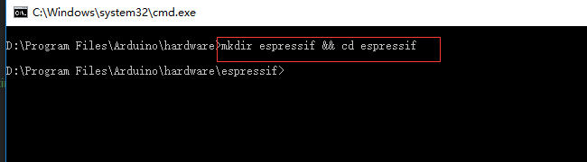


> * 将 esp32 idf clone 在文件夹 esp32 下

git clone --recursive https://github.com/espressif/arduino-esp32.git esp32

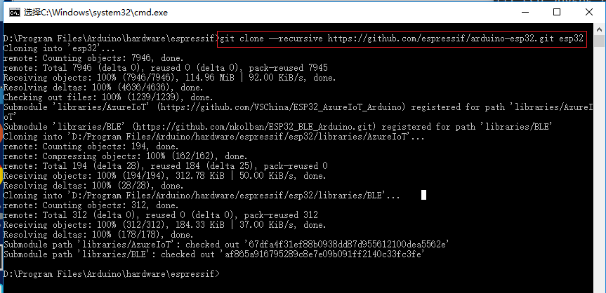


### 3、下载 ESP32 编译链 tools

进入此路径 D:\Program Files\arduino\hardware\espressif\esp32\tools
选中并双击执行 get.exe 文件

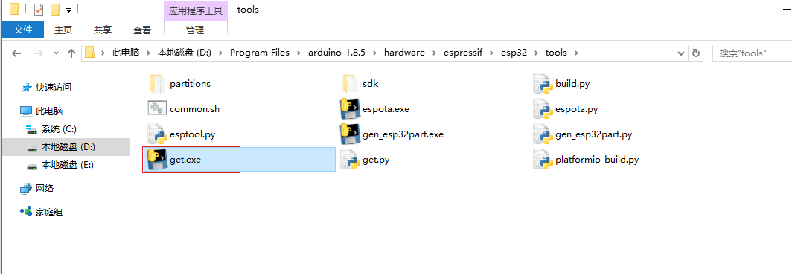

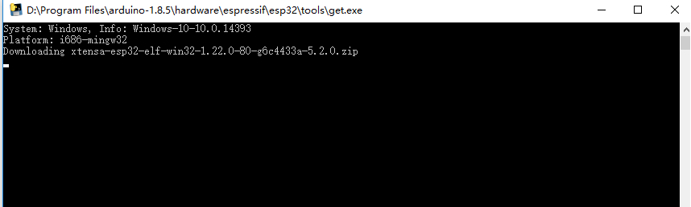


### 4、Arduino IDE 中下载 M5Stack 的库

打开 Arduino IDE 之后，选择“项目”->“加载库”->“管理库...”，搜索“M5Stack”并点击“安装”

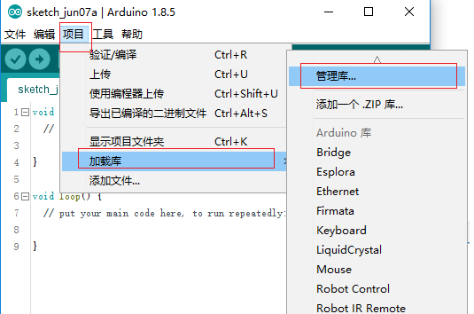

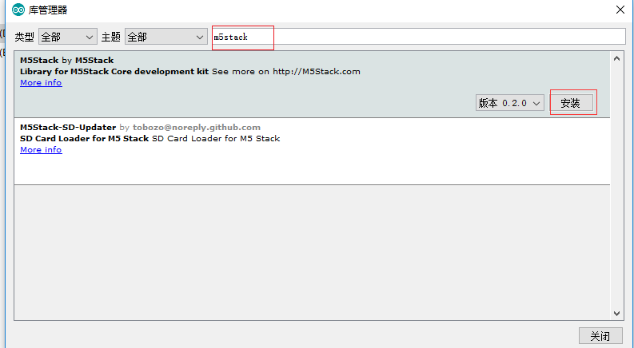


## 三、示例

USB 线连接 M5Stack 主控，选择串口和一个示例程序，compile and upload

### 1、打开一个示例程序，如打开 FactoryTest.ino

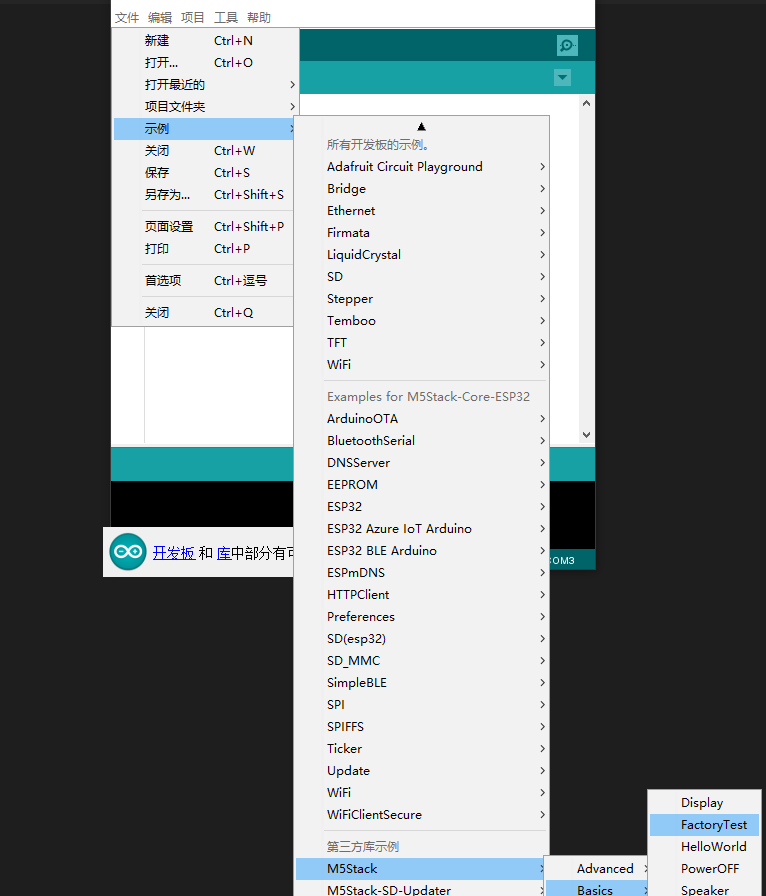


确认连接板子名称、串口波特率和当前串口号分别：M5Stack-Core-ESP32、921600、COM3(当前电脑串口号)

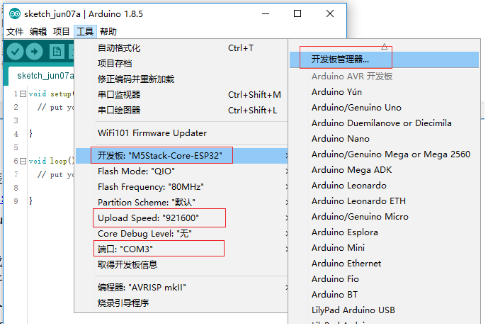


编译运行成功之后，串口监视窗口显示如下


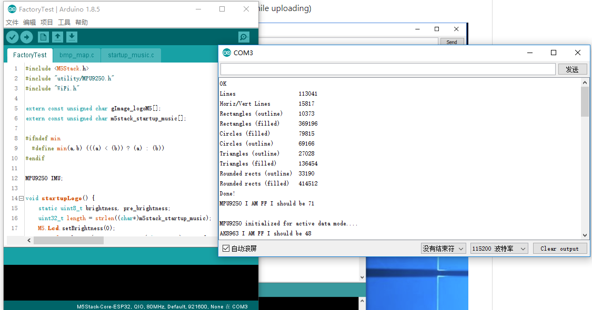

### 2、新建一个 M5Stack 程序

打开 Arduino IDE 之后，新建 .ino 文件，并保存为 my_test.ino

将如下代码拷贝进文件中。

```cpp
#include <M5Stack.h>

// the setup routine runs once when M5Stack starts up
void setup(){

  // Initialize the M5Stack object
  M5.begin();

  // LCD display
  M5.Lcd.print("Hello World!");
  M5.Lcd.print("M5Stack is running successfully!");    
}

// the loop routine runs over and over again forever
void loop() {

}
```

点击编译运行，此时 M5Stack 显示器显示 "Hello World!" "M5Stack is running successfully!"


